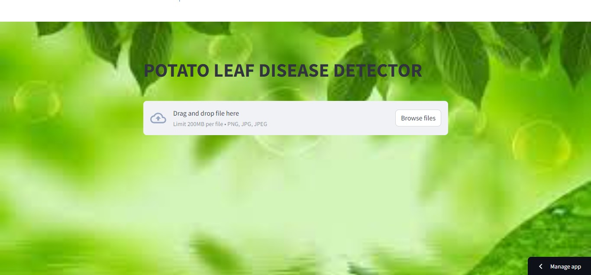

# Potato Leaf Disease Detection

This project aims to assist farmers in detecting diseases in potato plants using computer vision techniques. By simply uploading a photo of a potato leaf to the deployed application, users can identify the type of disease affecting their crop. The supported diseases include:

- Potato Healthy
- Potato Early Blight
- Potato Late Blight

## Deployed Application

You can try out the deployed application [here](https://devanshgoel1306-potato-leaf-disease-detection-app-6ry5kb.streamlit.app/).

## Usage

To use the application locally, follow these steps:

1. Clone the repository to your local machine.
2. Install the required dependencies by running:
pip install -r requirements.txt
3. Run the Streamlit app by executing:
streamlit run app.py
4. Once the app is running, upload an image of a potato leaf.
5. Click the "Predict" button to perform disease detection.

## Model

The disease detection model has been trained using the Plant Village Dataset available on Kaggle. The trained model is saved in the file `potatoes.h5`.

## Requirements

Ensure you have the necessary dependencies installed by running:
pip install -r requirements.txt

## Credits

- Plant Village Dataset: [Kaggle](https://www.kaggle.com/emmarex/plantdisease)
- Streamlit: [Streamlit Documentation](https://docs.streamlit.io/)

## Connect with Me

Feel free to connect with me on [LinkedIn](https://www.linkedin.com/in/devanshgoel1/) to learn more about this project and my other work.
